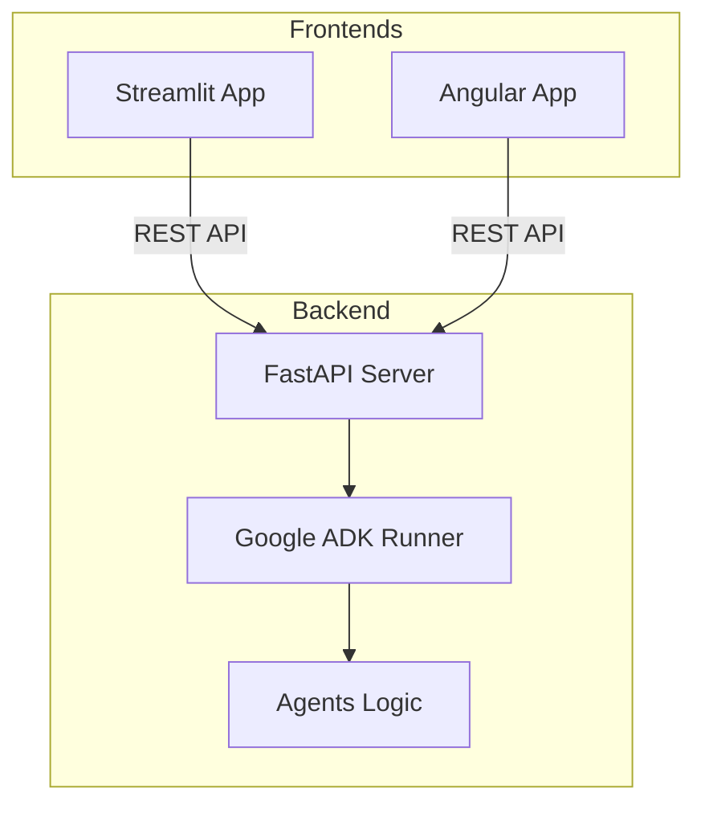

# ADK Custom UI Workspace

Welcome to the **ADK Custom UI Workspace**, a monorepository that demonstrates how to build custom user interfaces for AI agents powered by the **Google ADK (Agent Development Kit)**.

This repository follows a clean application-first structure, separating concerns between agentic backend logic and various frontend implementations (Streamlit, Angular).

---

## 🏗️ Project Architecture

The architecture is designed for modularity and scalability. Each component in the `apps/` directory serves a distinct purpose:




---

## 📂 Directory Structure: `apps/*`

The core of this workspace is located in the `apps/` directory, organized as follows:

```text
apps/
├── backend/               # FastAPI + Google ADK Backend
│   ├── agents/            # Custom AI agent logic
│   │   └── class_details_agent/
│   ├── backend.py         # FastAPI app with /chat endpoint
│   └── main.py            # Entry point
├── frontend/              # Streamlit Rapid Prototype
│   └── frontend.py        # Streamlit Chat UI
└── frontendangular/       # Angular Production UI
    ├── src/               # UI Components and Services
    └── package.json       # Node dependencies
```

### 1. `apps/backend`
The **heart of the ecosystem**. This is where the agentic intelligence lives.
- **Technology**: [FastAPI](https://fastapi.tiangolo.com/), [Google ADK](https://github.com/google/adk).
- **Responsibility**: 
    - Exposes a unified `/chat` REST endpoint.
    - Manages agent sessions using `InMemorySessionService`.
    - Handles asynchronous execution of Google GenAI models.
    - Hosts the `class_details_agent` and other agent logic.

### 2. `apps/frontend`
A **rapid prototyping frontend** for quick interaction with the agents.
- **Technology**: [Streamlit](https://streamlit.io/).
- **Responsibility**: 
    - Provides a chat-based user interface.
    - Consumes the backend API to display real-time responses.
    - Ideal for internal testing and LLM response validation.

### 3. `apps/frontendangular`
A **production-grade frontend** for high-quality, scalable user experiences.
- **Technology**: [Angular](https://angular.io/).
- **Responsibility**: 
    - Full-featured, component-based chat application.
    - Demonstrates modern frontend architecture (services, components, state management).
    - Communicates over HTTP with the FastAPI backend.

---

## 🚀 Getting Started

To get this whole ecosystem running, you'll need to start both the backend and at least one frontend.

### 🔑 Prerequisites

Ensure you have a `.env` file in `apps/backend/` with your API key:
```env
GOOGLE_API_KEY=your_google_api_key_here
```

### 🏃 Running the Backend
1. Go to the backend directory: `cd apps/backend`
2. Sync dependencies: `uv sync`
3. Run the FastAPI server: `uv run backend.py`
   *(Server starts at `http://localhost:8000`)*

### 🎨 Running the Frontends

#### Streamlit (Rapid Prototype)
1. Go to the frontend directory: `cd apps/frontend`
2. Sync dependencies: `uv sync`
3. Run the app: `uv run streamlit run frontend.py`

#### Angular (Modern UI)
1. Go to the frontend directory: `cd apps/frontendangular`
2. Install Node dependencies: `npm install`
3. Run the development server: `npm start`
   *(App starts at `http://localhost:4200`)*

---

## 🛠️ Tools Used
- **Google ADK**: Agent Development Kit for building robust AI agents.
- **UV**: An extremely fast Python package and project manager.
- **FastAPI**: Modern, fast (high-performance) web framework for building APIs with Python.
- **Streamlit**: The fastest way to build and share data apps.
- **Angular**: A component-based framework for building scalable web applications.
